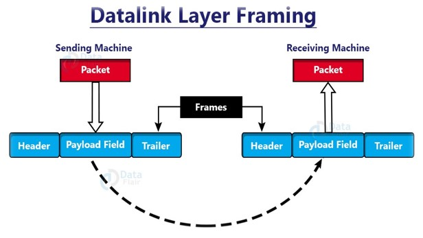

# Beyond 0s and 1s: Stuffing Intricacies

## Overview

Welcome to **'Beyond 0s and 1s: Stuffing Intricacies'** , a GitHub repository that delves into the sophisticated world of *bit and byte stuffing and destuffing*. This project focuses on transcending basic binary communication, exploring the nuanced world of stuffing mechanisms. It systematically unfolds the **intricacies of stuffing, fundamental techniques crucial for ensuring reliable data transmission in network protocols**.

## Table of Contents

- [Introduction](#introduction)
- [Key Concepts](#key-concepts)
- [Project Structure](#project-structure)
- [Usage](#usage)
- [Installation](#installation)
- [Contributing](#contributing)

## Introduction


Dive into **'Beyond 0s and 1s: Stuffing Intricacies'** —a project exploring bit and byte stuffing and destuffing for precise data transmission in networking. With dedicated implementations for bit stuffing, bit destuffing, byte stuffing, and byte destuffing, this project aims to provide a comprehensive understanding of these techniques. Explore the intricacies of reliable communication beyond binary intricacies.

Beginning with a comprehensive exploration of framing essentials and the anatomy of data frames, the project meticulously navigates through the strategic insertion and removal of bits and bytes to optimize data integrity. Through detailed code implementations and examples, the project demystifies the art of stuffing, providing a detailed understanding of its role in ensuring precise synchronization and safeguarding against errors in communication protocols. Key themes include **framing, their types, data integrity, synchronization, and networking**.

## Key Concepts

- **Framing:** Framing is a function of the data link layer. It provides a way for a sender to transmit a set of bits that are meaningful to the receiver. The stream of bits from the physical layer is divided into data frames.
  
  

- **Bit Stuffing and Destuffing:** Explore the strategic insertion and removal of bits for optimizing data integrity and synchronization.
- **Byte Stuffing and Destuffing:** Understand the role of byte stuffing in framing, providing insights into efficient data transmission.

-  **Flag Bytes**
   - The program starts and ends the stuffed data with flag bytes ('F').
   - Flag bytes help receivers identify the start and end of the stuffed data.

## Project Structure

- **`bit_stuffing.c`**: Implementation for bit stuffing.
- **`bit_destuffing.c`**: Implementation for bit destuffing.
- **`byte_stuffing.c`**: Implementation for byte stuffing.
- **`byte_destuffing.c`**: Implementation for byte destuffing.

## Usage

### Bit Stuffing:
1. **Overview:**
   - Prevents framing errors in network communication.
   - Involves strategic insertion of extra bits for synchronization.

2. **Application:**
   - Common in asynchronous communication protocols.
   - Ensures proper synchronization between sender and receiver.

### Bit Destuffing:
1. **Reverse Process:**
   - Removes extra bits added during bit stuffing.
   - Uses algorithms for accurate data reconstruction.

2. **Synchronization:**
   - Ensures received bits align correctly with expected framing.
   - Facilitates accurate interpretation of original data.

### Byte Stuffing:
1. **Handling Special Characters:**
   - Manages special characters within data.
   - Inserts additional bytes to prevent interference.

2. **Protocol Usage:**
   - Common in HDLC for reliable data transmission.
   - Prevents misinterpretation of control characters.

### Byte Destuffing:
1. **Reversing Process:**
   - Removes additional bytes from byte-stuffed stream.
   - Essential for maintaining data integrity during reception.

2. **Data Reconstruction:**
   - Allows accurate reconstruction of original data.
   - Ensures the removal of bytes introduced for framing.

## Installation

To make the most of 'Beyond 0s and 1s: Stuffing Intricacies,' follow these steps:

1. Clone the repository: ```git clone https://github.com/viren711/StuffingIntricacies```
2. Navigate to the repository to explore individual implementations.
3. Run the code snippets to better understand the functionality and intricacies.

## Contributing

I encourage contributions to 'Beyond 0s and 1s: Stuffing Intricacies'! Feel free to submit bug reports, suggest new features, or contribute code. Please follow the Contribution Guidelines. Your involvement helps improve the project for everyone.

